# UML Class Diagram — Movie Night Planner

The diagram below uses Mermaid syntax. Render it in any Mermaid-compatible viewer (e.g. mermaid.live, GitHub, VS Code with Mermaid extension).

```mermaid
classDiagram

%% ─── ENUMERATIONS ────────────────────────────────────────────────────────────

class Role {
  <<enumeration>>
  MEMBER
  ADMIN
}

class UserSystemRole {
  <<enumeration>>
  USER
  SYSTEM_ADMIN
}

class FriendshipStatus {
  <<enumeration>>
  PENDING
  ACCEPTED
  BLOCKED
}

class GroupInviteStatus {
  <<enumeration>>
  PENDING
  ACCEPTED
  DECLINED
  EXPIRED
}

class MovieCatalogSource {
  <<enumeration>>
  TMDB
  CUSTOM_ADMIN
}

%% ─── DOMAIN MODELS ───────────────────────────────────────────────────────────

class User {
  +String id
  +Int numericId
  +String email
  +String passwordHash
  +String displayName
  +UserSystemRole systemRole
  +DateTime createdAt
  +DateTime updatedAt
}

class UserPreferences {
  +String id
  +String userId
  +String[] favoriteGenres
  +String[] forYouExcludedGenres
  +DateTime createdAt
  +DateTime updatedAt
}

class RefreshToken {
  +String id
  +String userId
  +String token
  +DateTime expiresAt
  +DateTime revokedAt
}

class Group {
  +String id
  +String name
  +String slug
  +String description
  +String createdById
  +DateTime createdAt
  +DateTime updatedAt
}

class GroupMember {
  +String id
  +String groupId
  +String userId
  +Role role
  +DateTime joinedAt
}

class Session {
  +String id
  +String groupId
  +DateTime scheduledAt
  +Int movieTmdbId
  +String createdById
  +DateTime createdAt
  +DateTime updatedAt
}

class Vote {
  +String id
  +String sessionId
  +String userId
  +Int movieTmdbId
  +DateTime createdAt
  +DateTime updatedAt
}

class WatchlistEntry {
  +String id
  +String userId
  +Int tmdbId
  +DateTime addedAt
}

class WatchedEntry {
  +String id
  +String userId
  +Int tmdbId
  +Float rating
  +DateTime watchedAt
}

class MovieCatalogEntry {
  +String id
  +String title
  +String originalTitle
  +Int releaseYear
  +Int tmdbId
  +String posterPath
  +String customPosterUrl
  +String posterStorageKey
  +String genre
  +String synopsis
  +String adminNotes
  +MovieCatalogSource source
  +String addedByUserId
  +DateTime createdAt
  +DateTime updatedAt
}

class Friendship {
  +String id
  +String requesterUserId
  +String addresseeUserId
  +FriendshipStatus status
  +DateTime createdAt
  +DateTime updatedAt
}

class GroupInvite {
  +String id
  +String groupId
  +String inviterUserId
  +String inviteeUserId
  +GroupInviteStatus status
  +DateTime createdAt
  +DateTime updatedAt
  +DateTime expiresAt
}

%% ─── SERVICE LAYER ───────────────────────────────────────────────────────────

class AuthService {
  +register(dto) AuthResult
  +login(dto) AuthResult
  +refresh(refreshToken) TokenPair
  +revokeRefreshToken(tokenId) void
}

class UserService {
  +getById(id) User
  +updateProfile(userId, dto) User
  +getPreferences(userId) UserPreferences
  +searchUsers(query) User[]
  +updatePresence(userId) void
}

class GroupService {
  +create(userId, dto) Group
  +findForUser(userId) Group[]
  +getById(groupId) Group
  +update(groupId, dto) Group
  +delete(groupId) void
  +join(groupId, userId) void
  +leave(groupId, userId) void
  +getMembers(groupId) GroupMember[]
  +inviteMember(groupId, inviteeId) GroupInvite
}

class SessionService {
  +create(groupId, dto, userId) Session
  +listByGroup(groupId) Session[]
  +getById(groupId, sessionId) Session
  +update(groupId, sessionId, dto) Session
  +delete(groupId, sessionId) void
}

class VoteService {
  +castVote(groupId, sessionId, userId, movieTmdbId) Vote
  +getResults(groupId, sessionId) VoteResult[]
  +getMyVote(groupId, sessionId, userId) Vote
}

class MovieService {
  +searchTmdb(query) TmdbSearchResult[]
  +getTmdbDetails(tmdbId) TmdbMovieDetails
  +addToWatchlist(userId, tmdbId) void
  +removeFromWatchlist(userId, tmdbId) void
  +getWatchlist(userId) WatchlistEntry[]
  +markWatched(userId, dto) void
  +getRatings(userId) WatchedEntry[]
  +getCatalog() MovieCatalogEntry[]
  +addToCatalog(dto) MovieCatalogEntry
}

class RecommendationService {
  +getGroupRecommendations(groupId) RecommendationItem[]
}

class RecommendationEngine {
  +generateRecommendations(input) RecommendationOutput
}

%% ─── RELATIONSHIPS ───────────────────────────────────────────────────────────

User "1" --> "0..1" UserPreferences : has
User "1" --> "0..*" RefreshToken : has
User "1" --> "0..*" WatchlistEntry : has
User "1" --> "0..*" WatchedEntry : has
User "1" --> "0..*" GroupMember : participates via
User "1" --> "0..*" Vote : casts
User "1" --> "0..*" Group : creates
User "1" --> "0..*" Session : creates
User "1" --> "0..*" MovieCatalogEntry : adds
User "1" --> "0..*" Friendship : requests/receives
User "1" --> "0..*" GroupInvite : sends/receives

Group "1" --> "1..*" GroupMember : has
Group "1" --> "0..*" Session : has
Group "1" --> "0..*" GroupInvite : has

Session "1" --> "0..*" Vote : has

GroupMember --> Role : uses
User --> UserSystemRole : uses
Friendship --> FriendshipStatus : uses
GroupInvite --> GroupInviteStatus : uses
MovieCatalogEntry --> MovieCatalogSource : uses

AuthService ..> User : manages
UserService ..> User : manages
UserService ..> UserPreferences : manages
GroupService ..> Group : manages
GroupService ..> GroupMember : manages
GroupService ..> GroupInvite : manages
SessionService ..> Session : manages
VoteService ..> Vote : manages
MovieService ..> WatchlistEntry : manages
MovieService ..> WatchedEntry : manages
MovieService ..> MovieCatalogEntry : manages
RecommendationService ..> RecommendationEngine : delegates to
```

---

## Key Design Notes

- **Movies are not stored as rows** in the main model. `tmdbId` (an integer from TMDB API) is the foreign key used across `WatchlistEntry`, `WatchedEntry`, `Session`, and `Vote`. Full movie metadata is fetched on-demand from the TMDB API.
- **`MovieCatalogEntry`** is the only persistent movie record — it is the platform-admin-curated global catalog used for browse and recommendations scoring.
- **`GroupMember`** is a junction entity between `User` and `Group` that carries the `Role` (MEMBER or ADMIN).
- **`Friendship`** is a directed edge (requester → addressee) with a status that becomes bidirectional once ACCEPTED.
- **Service classes** are stateless orchestrators; they delegate persistence to Repository classes (not shown above for clarity).
