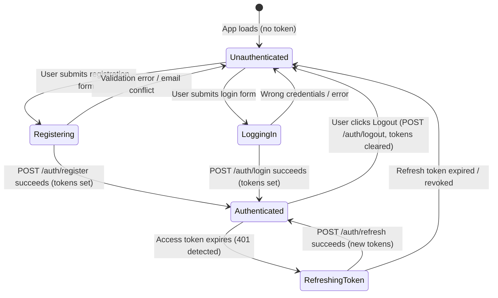
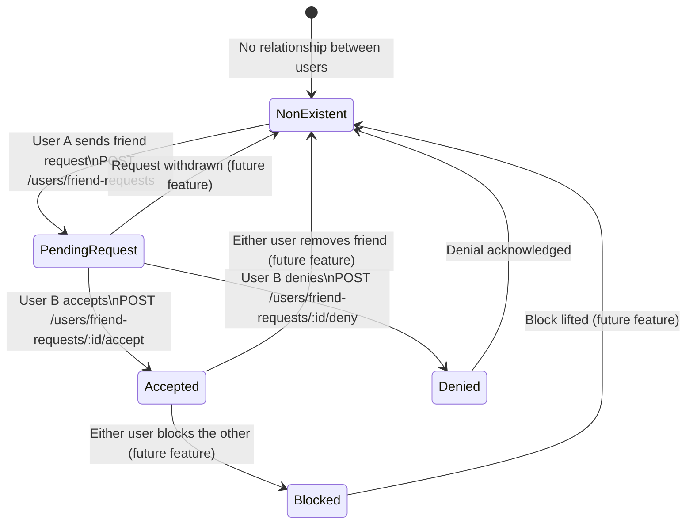
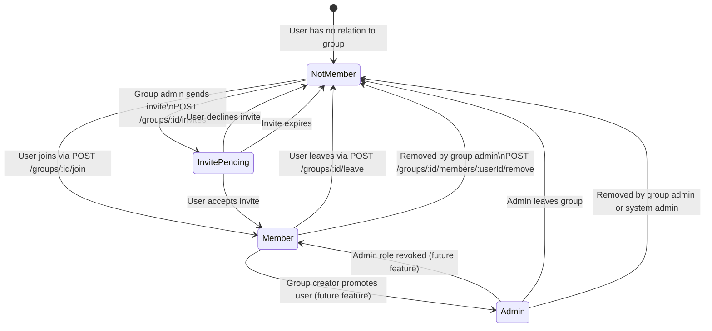
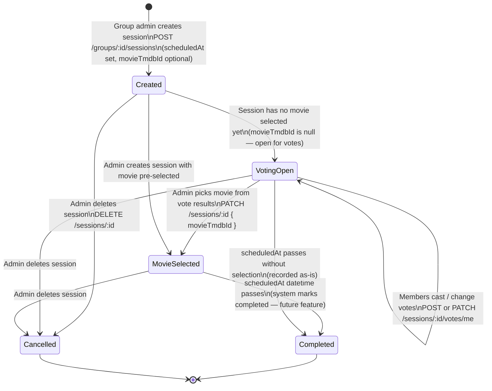
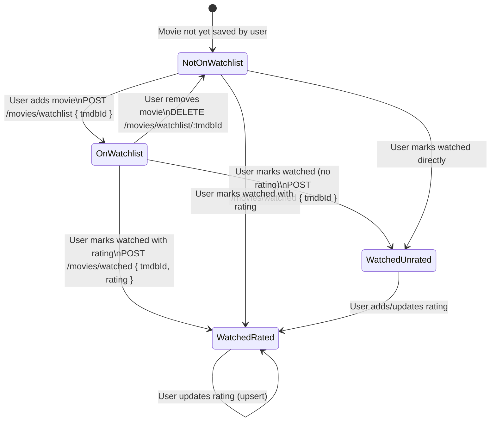
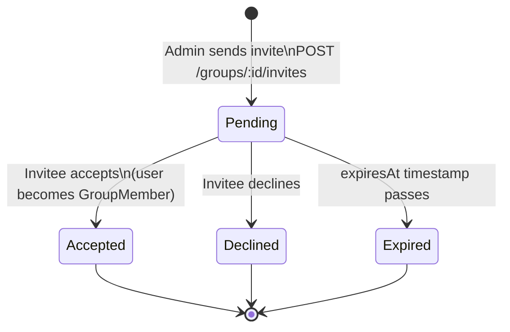

# System Statechart Diagrams — Movie Night Planner

All diagrams use Mermaid `stateDiagram-v2` syntax. Render in any Mermaid-compatible viewer.

---

## 1. User Authentication State

Covers the lifecycle of a user's session from unauthenticated to authenticated and back.

---

## 2. Friendship Request Lifecycle

Covers the state of a friendship record between two users.

---

## 3. Group Membership Lifecycle

Covers how a user's membership in a group progresses.

---

## 4. Movie Night Session Lifecycle

Covers the state of a session from creation to completion.

---

## 5. Vote Lifecycle Within a Session

Covers the state of a single user's vote within one session.

```mermaid
stateDiagram-v2
    [*] --> NoVote : Session created; user has not voted

    NoVote --> VoteCast : User casts vote\nPOST /sessions/:id/votes { movieTmdbId }

    VoteCast --> VoteChanged : User changes vote\nPATCH /sessions/:id/votes/me { movieTmdbId }

    VoteChanged --> VoteChanged : User changes vote again

    VoteCast --> [*] : Session completed or cancelled
    VoteChanged --> [*] : Session completed or cancelled
    NoVote --> [*] : Session completed without user voting
```

---

## 6. Movie Watchlist Entry Lifecycle

Covers a movie's state in a user's personal watchlist.

---

## 7. Group Invite Lifecycle

Covers the state of a group invite sent from an admin to a potential member.

